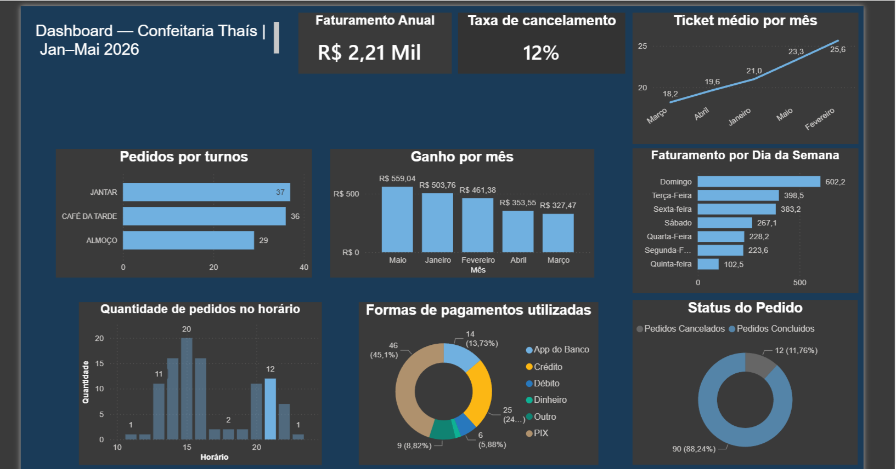

# 🍰 Confeitaria no iFood — Pipeline de Dados

Pipeline completo de engenharia de dados para análise de vendas de uma confeitaria real no iFood. O projeto cobre todas as etapas do ciclo de dados: extração, transformação, carga e visualização — respondendo perguntas reais de negócio que ajudam na tomada de decisão da loja.

---

## 📌 Contexto

A loja é uma confeitaria e doceria em Salvador-BA que vende pelo iFood. Os dados foram extraídos diretamente do portal do parceiro iFood e abrangem o período de janeiro a maio de 2026.

O objetivo é transformar relatórios brutos em informação útil — como quais dias faturam mais, quais horários têm pico de pedidos e qual a taxa de cancelamento — entregando isso em um dashboard acessível.

---

## 🏗️ Arquitetura do Pipeline

```
Portal iFood (.xlsx.zip)
        ↓
   Extração (Python)
        ↓
  Transformação (Pandas)
        ↓
  Carga (PostgreSQL)
        ↓
Views Analíticas (SQL)
        ↓
  Dashboard (Power BI)
        ↓
Orquestração (Airflow + Docker)
```

---

## 📊 Perguntas de Negócio Respondidas

- Qual o faturamento total e ticket médio por mês?
- Quais dias da semana geram mais receita?
- Em quais horários chegam mais pedidos?
- Qual a distribuição de pedidos por turno (almoço, café da tarde, jantar)?
- Qual a taxa de cancelamento?
- Quais são os meios de pagamento mais utilizados?

---

## 🛠️ Stack

| Camada | Tecnologia |
|---|---|
| Extração e transformação | Python, Pandas |
| Armazenamento | PostgreSQL |
| Modelagem analítica | SQL (Views) |
| Visualização | Power BI |
| Orquestração | Apache Airflow + Docker |

---

## 📁 Estrutura do Projeto

```
confeitaria-ifood-dados/
├── airflow-docker/
│   ├── dags/
│   │   └── dag_ifood.py         # DAG do pipeline
│   ├── logs/                    # Logs de execução do Airflow
│   └── docker-compose.yaml      # Configuração do Airflow com Docker
├── assets/
│   └── dashboard.png            # Print do dashboard
├── data/
│   ├── raw/                     # Relatórios originais .xlsx.zip do iFood
│   └── processed/
│       └── relatorio_pedidos.csv
├── pipeline/
│   ├── create_views.py          # Executa as views no PostgreSQL
│   ├── ingest.py                # Leitura e descompactação dos relatórios
│   ├── limpa_nomes.py           # Padronização de colunas
│   ├── load.py                  # Carga no PostgreSQL
│   └── transform.py             # Limpeza e transformação com Pandas
├── queries/
│   ├── 01_query_receita_total_dia.sql
│   ├── 02_query_receita_total_mes.sql
│   ├── 03_query_ticket_medio_mes.sql
│   ├── 04_query_quantidade_pedido_dia_da_semana.sql
│   ├── 05_query_quantidade_pedidos_concluidos_e_cancelados.sql
│   ├── 06_query_taxa_cancelamento.sql
│   ├── 07_query_pedidos_por_turno.sql
│   ├── 08_query_pedidos_meio_pagamento.sql
│   ├── 09_query_pedidos_hora.sql
│   └── 10_faturamento_ano.sql
├── .env                         # Variáveis de ambiente (não versionado)
├── .gitignore
└── README.md
```

---

## ⚙️ Como Executar

### Pré-requisitos

- Python 3.10+
- PostgreSQL rodando localmente
- Docker e Docker Compose
- Power BI Desktop

### Instalação

```bash
git clone https://github.com/tailansanttos/confeitaria-ifood-dados.git
cd confeitaria-ifood-dados
pip install pandas sqlalchemy psycopg2-binary openpyxl
```

### Configurar variáveis de ambiente

Crie um arquivo `.env` na raiz do projeto:

```
DB_HOST=localhost
DB_PORT=5432
DB_NAME=nome_do_banco
DB_USER=seu_usuario
DB_PASSWORD=sua_senha
```

### Rodando o pipeline manualmente

```bash
python pipeline/ingest.py
python pipeline/transform.py
python pipeline/load.py
python pipeline/create_views.py
```

### Rodando com Airflow

```bash
cd airflow-docker
docker-compose up -d
```

Acesse `http://localhost:8080`, ative a DAG `dag_pipeline_dados_ifood` e o pipeline será executado automaticamente.

---

## 📈 Dashboard

O dashboard foi construído no Power BI conectado diretamente ao PostgreSQL, consumindo as views analíticas criadas na camada SQL.



**Visões disponíveis:**
- Faturamento total e ticket médio por mês
- Ganho por mês
- Faturamento por dia da semana
- Quantidade de pedidos por horário
- Distribuição por turno
- Formas de pagamento utilizadas
- Status dos pedidos (concluídos vs cancelados)

---

## 📦 Dados

Os relatórios foram exportados do portal parceiro do iFood no formato `.xlsx.zip`. Por questões de privacidade, os dados brutos não estão disponíveis no repositório. A estrutura esperada dos arquivos está documentada em `pipeline/ingest.py`.

---

## 🚀 Próximos Passos

- [ ] Ingestão dos dados financeiros do portal iFood
- [ ] JOIN entre pedidos e financeiro para análise de margem real

---

## 👨‍💻 Autor

**Tailan Santos**  
[linkedin.com/in/tailansantos](https://linkedin.com/in/tailansantos) · [github.com/tailansanttos](https://github.com/tailansanttos)